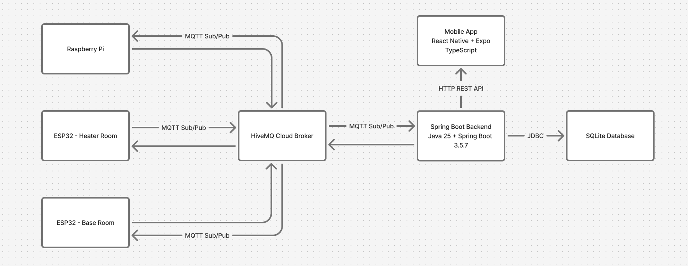

# ThermaLink Mobile Backend

RESTful API backend for the ThermaLink IoT temperature control and occupancy detection system. Built with Spring Boot, this backend handles MQTT communication with IoT devices, data persistence, and provides REST APIs for mobile app consumption.

## 📋 Table of Contents

- [Overview](#overview)
- [System Architecture](#system-architecture)
- [Features](#features)
- [Tech Stack](#tech-stack)
- [Project Structure](#project-structure)
- [Getting Started](#getting-started)
- [Configuration](#configuration)
- [API Documentation](#api-documentation)
- [MQTT Integration](#mqtt-integration)
- [Database Schema](#database-schema)
- [Testing](#testing)
- [Production Considerations](#production-considerations)

## 🎯 Overview

The ThermaLink Mobile Backend is a Spring Boot application that:
- Receives real-time temperature data from ESP32 sensors via MQTT
- Processes person detection events from Raspberry Pi camera with YOLO
- Stores IoT data in SQLite database
- Provides REST APIs for mobile app to retrieve current status
- Handles MQTT broker authentication and lifecycle management

### Key Capabilities

✅ **Real-time MQTT Communication** - Subscribes to temperature and camera topics  
✅ **Data Persistence** - SQLite database with JPA/Hibernate  
✅ **REST APIs** - Mobile-friendly endpoints for current status  
✅ **Cross-Origin Support** - CORS configured for mobile apps  
✅ **Automatic Reconnection** - Robust MQTT client with auto-reconnect  
✅ **Logging** - Comprehensive logging with Logback

## 🏗️ System Architecture


### Data Flow

1. **IoT Devices → MQTT Broker**: Sensors publish temperature/detection data
2. **MQTT Broker → Backend**: Backend subscribes and receives messages
3. **Backend → Database**: Data is validated and persisted
4. **Mobile App → Backend**: REST API requests for current status
5. **Backend → Mobile App**: JSON responses with latest data

## ✨ Features

### MQTT Integration
- **Temperature Monitoring**: Subscribes to `temperature/status/base` and `temperature/status/heater`
- **Occupancy Detection**: Subscribes to `camera/status` for person detection
- **QoS 1**: At-least-once message delivery
- **Auto-Reconnect**: Automatic reconnection on connection loss
- **Secure Connection**: TLS/SSL encryption to HiveMQ Cloud

### REST API
- **Temperature Endpoints**: Get current temperature by room or all rooms
- **Detection Endpoints**: Get latest person detection status
- **CORS Enabled**: Configurable cross-origin support for mobile apps
- **JSON Responses**: Mobile-friendly data format

### Data Management
- **Real-time Storage**: Automatic saving of all sensor readings
- **Query Optimization**: Efficient retrieval of latest readings
- **ISO Timestamps**: Consistent datetime format across system

### Operational
- **Health Monitoring**: Application ready/shutdown event logging
- **Error Handling**: Comprehensive exception handling
- **Logging**: Structured logging with file rotation (10MB max, 20 files, 5GB total)
- **Environment Variables**: Secure configuration via .env files

## 🛠️ Tech Stack

### Core Framework
- **Spring Boot 3.5.7** - Application framework
- **Java 25** - Programming language
- **Maven** - Build tool and dependency management

### Data & Persistence
- **Spring Data JPA** - Data access layer
- **Hibernate** - ORM framework
- **SQLite 3.50.3.0** - Embedded database
- **Hibernate Community Dialects** - SQLite dialect support

### MQTT & IoT
- **HiveMQ MQTT Client 1.3.9** - MQTT 5 async client
- **TLS/SSL** - Secure broker connection

### Security & Web
- **Spring Security** - Authentication and authorization framework
- **Spring Web** - REST API support
- **CORS Configuration** - Cross-origin resource sharing

### Utilities
- **Lombok** - Boilerplate code reduction
- **Jakarta Validation** - Input validation
- **SLF4J 2.0.17** - Logging facade
- **Logback** - Logging implementation
- **Dotenv Java 2.3.2** - Environment variable management

### Development & Testing
- **Spring Boot DevTools** - Development utilities
- **Spring Boot Test** - Testing framework
- **JUnit** - Unit testing


## 📁 Project Structure

```
Mobile_Backend/
├── src/
│   ├── main/
│   │   ├── java/com/iot/mobile_backend/
│   │   │   ├── MobileBackendApplication.java      # Main application entry point
│   │   │   ├── config/
│   │   │   │   ├── MQTTConfig.java                # MQTT client configuration
│   │   │   │   ├── CORSConfig.java                # CORS settings
│   │   │   │   └── SecurityConfig.java            # Spring Security config
│   │   │   ├── controller/
│   │   │   │   ├── TempController.java            # Temperature REST endpoints
│   │   │   │   └── PersonDetectController.java    # Detection REST endpoints
│   │   │   ├── dto/
│   │   │   │   ├── TemperatureDTO.java            # Temperature data transfer object
│   │   │   │   └── PersonDetectionDTO.java        # Detection data transfer object
│   │   │   ├── model/
│   │   │   │   ├── TemperatureSensor.java         # Temperature entity
│   │   │   │   └── PersonDetection.java           # Detection entity
│   │   │   ├── repository/
│   │   │   │   ├── TempRepository.java            # Temperature data access
│   │   │   │   └── PersonDetectRepo.java          # Detection data access
│   │   │   └── service/
│   │   │       ├── MqttService.java               # MQTT message handling
│   │   │       ├── TemperatureService.java        # Temperature business logic
│   │   │       └── PersonDetectService.java       # Detection business logic
│   │   └── resources/
│   │       ├── application.properties             # App configuration
│   │       └── logback-spring.xml                 # Logging configuration
│   └── test/
│       └── java/com/iot/mobile_backend/
│           └── MobileBackendApplicationTests.java # Ignore this directory
├── logs/                                          # Log files (auto-generated)
├── .env                                           # Environment variables (not committed)
├── .env.example                                   # Environment template
├── pom.xml                                        # Maven dependencies
├── mvnw                                           # Maven wrapper (Unix)
├── mvnw.cmd                                       # Maven wrapper (Windows)
└── README.md                                      # This file
```

## 🚀 Getting Started

### Prerequisites

- **Java 25** or compatible JDK
- **Maven 3.9+** (or use included Maven wrapper)
- **MQTT Broker** - HiveMQ Cloud account (or compatible broker)

### Installation

1. **Clone the repository**
   ```bash
   git clone https://github.com/HMC03/ThermaLink.git
   cd iot-control-app/Mobile_Backend
   ```

2. **Configure environment variables**
   ```bash
   cp .env.example .env
   nano .env
   ```

   Add your configuration:
   ```env
   CORS_ALLOWED_ORIGIN=*
   MQTT_BROKER_HOST=your-broker.hivemq.cloud
   MQTT_BROKER_PORT=8883
   MQTT_USERNAME=your-username
   MQTT_PASSWORD=your-password
   MQTT_CLIENT_ID=mobile_backend
   ```
   
3. **Run the application**
   ```bash
   ./mvnw spring-boot:run
   ```

4. **Verify it's running**
   ```bash
   curl http://localhost:8080/api/temperature/current/all # Should return empty array and 200 OK
   ```

### Quick Start with Mock Data

Test the backend without hardware using the mock testing scripts:

```bash
# In another terminal, run mock sensors
cd ../Backend_Mock_Test
python3 run_temperature_test.py
python3 run_mock_test.py
```

See the [Testing Guide](../Backend_Mock_Test/TESTING_GUIDE.md) for details.

## ⚙️ Configuration

### Environment Variables

Required environment variables (set in `.env` file):

| Variable | Description | Example                      |
|----------|-------------|------------------------------|
| `CORS_ALLOWED_ORIGIN` | Allowed origins for CORS | `*` or `<your-frontend-url>` |
| `MQTT_BROKER_HOST` | MQTT broker hostname | `your-broker.hivemq.cloud`   |
| `MQTT_BROKER_PORT` | MQTT broker port | `8883`                       |
| `MQTT_USERNAME` | MQTT username | `your-username`              |
| `MQTT_PASSWORD` | MQTT password | `your-password`              |
| `MQTT_CLIENT_ID` | MQTT client identifier | `mobile_backend`             |

### Application Properties

Key settings in `application.properties`:

```properties
# Application name
spring.application.name=Mobile_Backend

# Database (SQLite)
spring.datasource.url=jdbc:sqlite:iotdb.db
spring.datasource.driverClassName=org.sqlite.JDBC
spring.jpa.hibernate.ddl-auto=update
spring.jpa.database-platform=org.hibernate.community.dialect.SQLiteDialect

# SQL debugging (disable in production)
spring.jpa.show-sql=true
spring.jpa.properties.hibernate.format_sql=true

# MQTT Configuration (from environment)
mqtt.brokerHost=${MQTT_BROKER_HOST:localhost}
mqtt.brokerPort=${MQTT_BROKER_PORT:8883}
mqtt.username=${MQTT_USERNAME}
mqtt.password=${MQTT_PASSWORD}
mqtt.clientId=${MQTT_CLIENT_ID:mobile_backend}
```

### Logging Configuration

Configured in `logback-spring.xml`:
- **Console Output**: Colored, formatted logs
- **File Output**: Rotating logs in `logs/` directory
    - Max file size: 10MB
    - Max history: 20 files
    - Total size cap: 5GB
- **Log Levels**: INFO for app, WARN for Spring/Hibernate

## 📡 API Documentation

### Base URL (Spring Boot)
```
http://localhost:8080
```

### Temperature Endpoints (assuming there is data in the database)

#### Get Current Temperature (All Rooms)
```http
GET /api/temperature/current/all
```

**Response:**
```json
[
  {
    "id": 1,
    "roomType": "base",
    "temperature": 70.5,
    "recordingTime": "2024-11-20T14:30:15"
  },
  {
    "id": 2,
    "roomType": "heater",
    "temperature": 72.3,
    "recordingTime": "2024-11-20T14:30:15"
  }
]
```

#### Get Current Temperature (Specific Room)
```http
GET /api/temperature/current/{roomType}
```

**Parameters:**
- `roomType` (path): `base` or `heater`

**Response:**
```json
{
  "id": 1,
  "roomType": "base",
  "temperature": 70.5,
  "recordingTime": "2024-11-20T14:30:15"
}
```

**Error Responses:**
- `400 Bad Request`: Invalid room type
- `404 Not Found`: No data for specified room
- `500 Internal Server Error`: Server error

#### Create Temperature Record (Testing Only)
```http
POST /api/temperature/create?roomtype=base&temperature=70.5&recordingtime=2024-11-20T14:30:15
```

**Note**: In production, temperature data comes from IoT devices via MQTT, not this endpoint.

### Person Detection Endpoints

#### Get Latest Detection Status
```http
GET /api/person-detect/status
```

**Response:**
```json
{
  "id": 1,
  "personDetected": true,
  "confidence": 0.87,
  "detectionTime": "2024-11-20T14:30:15"
}
```

**Error Responses:**
- `404 Not Found`: No detection data available
- `500 Internal Server Error`: Server error

#### Create Detection Record (Testing Only)
```http
POST /api/person-detect/create?persondetected=true&confidence=0.87&recordingtime=2024-11-20T14:30:15
```

**Note**: In production, detection data comes from Raspberry Pi via MQTT, not this endpoint.

## 📨 MQTT Integration

### Subscribed Topics

The backend automatically subscribes to the following topics on startup:

| Topic | QoS | Purpose | Message Format |
|-------|-----|---------|----------------|
| `temperature/status/base` | 1 | Base room temperature | `{"room":"base","temperature":70.5,"timestamp":"2024-11-20T14:30:15"}` |
| `temperature/status/heater` | 1 | Heater room temperature | `{"room":"heater","temperature":72.3,"timestamp":"2024-11-20T14:30:15"}` |
| `camera/status` | 1 | Person detection | `{"person_detected":true,"confidence":0.87,"timestamp":"2024-11-20T14:30:15"}` |

### MQTT Client Configuration

Configured in `MQTTConfig.java`:
- **Protocol**: MQTT 5.0
- **Transport**: TLS/SSL encrypted
- **Connection**: Automatic reconnection with exponential backoff (1s to 10s)
- **Lifecycle Logging**: Connected/disconnected events logged

### Message Handling

**Temperature Messages** (`MqttService.handleTemperatureMessage()`):
1. Receives JSON payload from MQTT
2. Parses room type, temperature, and timestamp
3. Validates inputs (non-empty room, temperature ≥ 0)
4. Creates `TemperatureDTO` object
5. Calls `TemperatureService.recordTemperature()`
6. Logs success or errors

**Detection Messages** (`MqttService.handlePersonDetectionMessage()`):
1. Receives JSON payload from MQTT
2. Parses detection status, confidence, and timestamp
3. Validates confidence (0.0 to 1.0)
4. Creates `PersonDetectionDTO` object
5. Calls `PersonDetectService.recordPersonDetection()`
6. Logs "Person entered" if detected with confidence ≥ 0.65
7. Logs errors if any

### Error Handling

- **Connection Failures**: Application exits with code 1 on connection failure
- **Authentication Errors**: Detected and logged with clear messages
- **Message Parsing Errors**: Logged, message skipped, no data saved
- **Invalid Data**: Validated and logged, no database write

## 🗄️ Database Schema

### SQLite Database: `iotdb.db`

#### Table: `temperature_activity`

Stores temperature sensor readings.

| Column | Type | Constraints | Description |
|--------|------|-------------|-------------|
| `id` | BIGINT | PRIMARY KEY, AUTO_INCREMENT | Unique identifier |
| `room_type` | VARCHAR(255) | NOT NULL | Room identifier (`base` or `heater`) |
| `temperature_f` | DOUBLE | NOT NULL | Temperature in Fahrenheit |
| `recording_time` | TIMESTAMP | NOT NULL | ISO 8601 timestamp |

**Sample Queries:**
```sql
-- Get latest temperature for base room
SELECT * FROM temperature_activity 
WHERE room_type = 'base' 
ORDER BY recording_time DESC 
LIMIT 1;

-- Get all latest temperatures (one per room)
SELECT * FROM temperature_activity t1
WHERE id IN (
    SELECT MAX(id) FROM temperature_activity 
    GROUP BY room_type
);
```

#### Table: `person_detection`

Stores person detection events from camera.

| Column | Type | Constraints | Description |
|--------|------|-------------|-------------|
| `id` | BIGINT | PRIMARY KEY, AUTO_INCREMENT | Unique identifier |
| `person_detected` | BOOLEAN | NOT NULL | True if person detected |
| `confidence` | DOUBLE | NOT NULL | Detection confidence (0.0-1.0) |
| `detection_time` | TIMESTAMP | NOT NULL | ISO 8601 timestamp |

**Sample Queries:**
```sql
-- Get latest detection
SELECT * FROM person_detection 
ORDER BY detection_time DESC 
LIMIT 1;

-- Get high-confidence detections (threshold: 0.65)
SELECT * FROM person_detection 
WHERE confidence >= 0.65 
ORDER BY detection_time DESC;
```

## 🧪 Testing

### Manual API Testing

Using CURL:
```bash
# Get all temperatures
curl -X GET http://localhost:8080/api/temperature/current/all

# Get base room temperature
curl -X GET http://localhost:8080/api/temperature/current/base

# Get latest detection
curl -X GET http://localhost:8080/api/person-detect/status

# Create test temperature record
curl -X POST "http://localhost:8080/api/temperature/create?roomtype=base&temperature=71.5&recordingtime=2024-11-20T14:30:15"

# Create test detection record
curl -X POST "http://localhost:8080/api/person-detect/create?persondetected=true&confidence=0.85&recordingtime=2024-11-20T14:30:15"
```

## 🔒 Production Considerations

### Current Implementation (Class Project)

✅ **What Works:**
- Functional MQTT integration
- REST API endpoints
- Data persistence
- Basic error handling
- CORS support
- Environment-based config

⚠️ **What's Missing for Production:**

This is a **class project** demonstrating IoT concepts. For production deployment, you would need:

1. **Security**
    - JWT authentication for API endpoints
    - API key validation for IoT devices
    - HTTPS/TLS enforcement
    - Rate limiting
    - Input sanitization

2. **Database**
    - PostgreSQL or MySQL instead of SQLite
    - Connection pooling (HikariCP)
    - Database replication
    - Automated backups
    - Query optimization and indexing

3. **Scalability**
    - Load balancer (nginx/AWS ALB)
    - Multiple backend instances
    - Redis caching layer
    - Message queue (RabbitMQ/Kafka)
    - Auto-scaling

4. **Monitoring**
    - Application metrics (Prometheus)
    - Log aggregation (ELK stack)
    - Distributed tracing (OpenTelemetry)
    - Alerting (PagerDuty)
    - Health checks

5. **DevOps**
    - CI/CD pipeline
    - Docker containerization
    - Kubernetes orchestration
    - Blue-green deployments
    - Disaster recovery plan

## 🐛 Troubleshooting

### MQTT Connection Issues

**Problem**: Backend can't connect to MQTT broker

**Solutions:**
```bash
# 1. Verify credentials in .env
cat .env | grep MQTT

# 2. Test broker connectivity
ping your-broker.hivemq.cloud

# 3. Check HiveMQ Cloud console for:
#    - Correct username/password
#    - Client ID not already in use
#    - Connection limits not exceeded

# 4. Review logs
tail -f logs/server-*.log | grep -i mqtt
```

### Database Issues

**Problem**: Database errors or data not saving

**Solutions:**
```bash
# 1. Check if database file exists
ls -lh iotdb.db

# 2. Verify tables were created
sqlite3 iotdb.db ".tables"

# 3. Check table schemas
sqlite3 iotdb.db ".schema temperature_activity"
sqlite3 iotdb.db ".schema person_detection"

# 4. Review Hibernate logs
grep -i "hibernate" logs/server-*.log
```

### API Not Responding

**Problem**: REST API endpoints return errors

**Solutions:**
```bash
# 1. Verify application is running
ps aux | grep java

# 2. Check if port 8080 is in use
lsof -i :8080

# 3. Review application logs
tail -f logs/server-*.log

# 4. Test with verbose curl
curl -v http://localhost:8080/api/temperature/current/all
```

### No Data from IoT Devices

**Problem**: Backend not receiving MQTT messages

**Solutions:**
```bash
# 1. Verify MQTT client connected
grep "MQTT client connected" logs/server-*.log

# 2. Check subscriptions succeeded
grep "Subscribed to topic" logs/server-*.log

# 3. Test with mock scripts
python3 ../Backend_Mock_Test/run_temperature_test.py

# 4. Monitor MQTT messages in logs
tail -f logs/server-*.log | grep "Received"
```

## 📄 License

This is a class project developed for educational purposes.

**Built with ☕ and Spring Boot for CSC 591/ECE 592: Internet of Things - Fall 2025**

